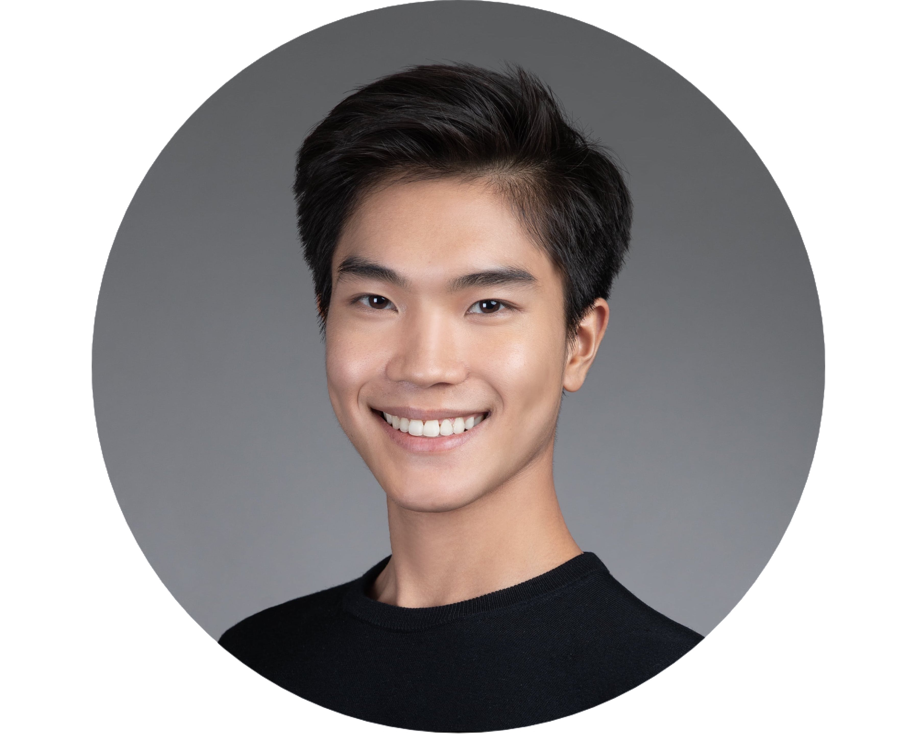

{style="width: 40%;"}

**Eugene Wong**

(he/him/his)

**Hi!** I am Eugene, a second year PhD student in [**Speech-Language-Hearing Sciences at the University of Minnesota**](https://cla.umn.edu/slhs). I am also a proud Hongkonger, born and raised in Hong Kong and a native speaker of Cantonese. 

My main research interests are in sociophonetics and speech production. I am interested in how children acquire socially meaningful variation of speech, and how adults use voice quality features to express their social identities. 

Before coming to the University of Minnesota, I worked as a lab manager in the [**Department of Chinese and Bilingual Studies at the Hong Kong Polytechnic University**](https://www.polyu.edu.hk/cbs/). 

email: [wong0703@umn.edu](mailto:wong0703@umn.edu)

My full CV is available [here](CV_Eugene Wong_resize.pdf).

