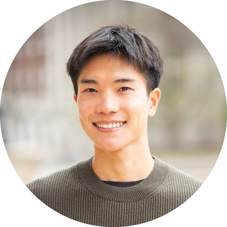

{style="width: 40%;"}

**Eugene Wong**

(he/him/his)

**Hi!** I am Eugene, a postdoc at the **DUAL Lab** at the **University of Texas at Dallas**. I recieved my PhD in Speech-Language-Hearing Sciences from the University of Minnesota. I am also a Hongkonger, born and raised in Hong Kong and a native speaker of Cantonese. 

At UT Dallas, I work with **Anny Castilla-Earls** on language development in bilingual children at risk for developmental language disorder. 

During my PhD training in Minnesota, my research focused on using acoustic methods to study early speech and language development. I worked with **Benjamin Munson** on the acquisition of gender-related speech variation, and measures of speech accuracy. I also worked with **Kerry Ebert** and **Lizbeth Finestack** on bilingual language development. You can learn more about my research on  [GoogleScholar](https://scholar.google.com/citations?hl=en&user=Fc6zOuYAAAAJ) and [ResearchGate](https://www.researchgate.net/profile/Eugene-Wong-16?ev=hdr_xprf).

email: [eugene.wong@utdallas.edu](mailto:eugene.wong@utdallas.edu)

My full CV is available [here](Wong_CVupdated2026.docx.pdf).

